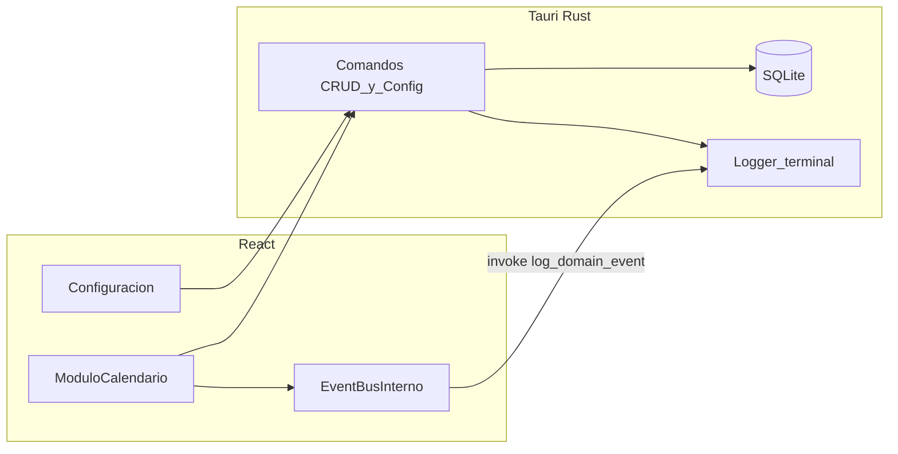

# Plan: Consultorio hiperbárico / sueroterapia (Fase 1 y base)

## Contexto

- Repositorio vacío: se creará el esqueleto completo en `[Proyecto_Renew_Lab](c:\Users\lpelaez\OneDrive - PREMEX S.A.S\Iluma_Local\05. Code_Lucas\Proyecto_Renew_Lab)`.
- Restricciones clave: **sin FullCalendar ni similares**; cuadrícula **30 min**; rango **[7:00, 20:00)** (último fin permitido 20:00); módulo calendario solo **emite eventos**; SQLite **local**; zona horaria **del sistema**.

## Supuesto explícito (capacidad y servicios nuevos)

- Cada **tipo de servicio** configurable tiene un **máximo de citas concurrentes** (entero ≥ 1). Valores iniciales: **Cámara Hiperbárica = 2**, **Sueroterapia = 2**. Al **añadir un tipo desde la UI de configuración**, se asignará **capacidad por defecto 1** (editable en el mismo panel). Si prefieres otro default, se ajusta en una línea de config.

## Arquitectura orientada a eventos (v1)

- **EventBus interno (frontend):** `EventTarget` nativo o un `EventEmitter` mínimo en TypeScript; los componentes de dominio (calendario / citas) publican `cita_creada`, `cita_completada`, `cita_cancelada` con el **payload acordado**.
- **Terminal:** un comando Tauri `log_domain_event` recibe el payload (JSON) y hace `println!`/tracing con el contenido para verificar en la consola del proceso.
- **No** se implementan módulos de inventario ni finanzas; solo el hook de observabilidad.

**Payload obligatorio** en cada emisión: `cita_id`, `paciente_documento`, `tipo_servicio`, `estado`, `timestamp` (ISO-8601 en TZ del sistema).

**Disparadores propuestos:**

| Evento            | Cuándo                                                                                                                      |
| ----------------- | --------------------------------------------------------------------------------------------------------------------------- |
| `cita_creada`     | Tras persistir creación correcta                                                                                            |
| `cita_completada` | Tras cambiar asistencia a **asistió** o **no asistió** (estado final de la cita)                                            |
| `cita_cancelada`  | Tras eliminar una cita **no pasada** (soft-delete opcional; puede ser borrado físico si no necesitas historial legal en v1) |

Si quieres que `cita_completada` solo dispare con “asistió” y no con “no asistió”, se cambia en una sola condición.

## Stack y setup

- **Scaffold:** `create-tauri-app` con plantilla React + TypeScript + Vite; Rust edition acorde a Tauri 2.x estable.
- **Tailwind:** integración en Vite (`tailwind.config`, `postcss`, directives en entrada CSS).
- **SQLite:** inicialización en Rust al arrancar (**una ruta estable** vía `app_data_dir` de Tauri), migraciones versionadas (SQL embebido o carpeta `migrations/`).
- **Comunicación:** comandos Tauri `invoke` para citas, configuración y logging; **sin** exponer SQL al frontend.

## Modelo de datos (SQLite)

**Tabla `appointments` (citas), campos mínimos:**

- `id` (TEXT UUID o INTEGER PK según convención elegida)
- `patient_full_name`
- `document_type`, `document_number` (alfanumérico)
- `phone_e164` o `phone_prefix` + `phone_national` (obligatorio; prefijo según país seleccionado, default CO +57)
- `birthday_month` (INTEGER 1–12, nullable si no aplica)
- `appointment_date` (TEXT ISO date `YYYY-MM-DD` con año)
- `start_time`, `end_time` (TEXT `HH:MM` en **24 h internamente** para simplificar orden y solapes; la UI muestra 12/24 según config)
- `service_type` (TEXT, pertenece a lista configurada)
- `status`: `pendiente` | `asistio` | `no_asistio` (futuras en `pendiente` por defecto)
- `created_at`, `updated_at`

**Índices:** por `(appointment_date)` y posiblemente compuesto para consultas de semana.

**Tabla `settings` (clave-valor JSON o columnas tipadas):** almacenar en un solo lugar:

- `show_sundays` (bool)
- `time_display` (`12h`  `24h`)
- `default_duration_minutes` (múltiplo de 30, default 60)
- `document_types` (JSON array; inicial sugerido: **CC** (default), **CE**, **TI**, **PA**, **RC**, **NIT** — alineado a lista cerrada editable)
- `service_types` (JSON array de `{ id | name, label, concurrent_capacity }`; inicial: Cámara Hiperbárica y Sueroterapia con capacidades 2)
- `default_document_type` = `CC`

Valores por defecto se insertan en migración inicial si la tabla está vacía.

## Reglas de negocio (backend + validación replicada en UI)

1. **Horas:** `start` y `end` alineados a **minutos 0 o 30**; `end > start`; ventana contenida en **[07:00, 20:00)** (fin ≤ `20:00`).
2. **Duración:** múltiplos de 30 min; la UI puede sugerir fin = inicio + `default_duration_minutes` editable al crear.
3. **Capacidad concurrente:** para el par `(fecha, tipo_servicio)`, contar citas con solape temporal que no estén “canceladas/eliminadas”; si `count >= capacity(service_type)` → **rechazar** y devolver error claro para **alerta** en UI.
4. **Eliminar:** solo si `appointment_date` + `end_time` es **estrictamente futuro** respecto a “ahora” en TZ local (definir comparación consistente fecha+hora local).
5. **Editar:** **futuras:** todos los campos editables salvo restricciones; **pasadas:** solo permitir cambiar **estado de asistencia** (asistió / no asistió); el resto solo lectura (así se evita reescritura inconsistente del historial).

## UI: vista semanal y cuadrícula

- **Cabecera:** navegación **semana anterior / siguiente**, indicador de rango semanal; columna de horas a la izquierda.
- **Columnas:** L–S siempre; **Domingo** condicionado por `show_sundays` (6 vs 7 columnas).
- **Filas:** una fila por slot de 30 min entre 7:00 y 19:30; altura fija configurable por constante (p. ej. `SLOT_HEIGHT_PX` en un módulo de constantes) para legibilidad.
- **Eventos (“cajones”):** posicionamiento tipo bloque absoluto dentro de cada celda-día: calcular `top`/`height` desde inicio y duración; para **solapes** en el mismo día: algoritmo de **interval scheduling** (agrupar solapados, asignar columna y `width` como `%` como en Google Calendar) **sin librería externa**.
- **Colores:** tokens Tailwind (p. ej. diferencia suave por tipo de servicio + borde); contraste suficiente para lectura prolongada.

## Módulos frontend (carpetas sugeridas)

- `src/core/config` — lectura de settings vía Tauri.
- `src/core/eventBus` — bus interno + tipos de eventos y payload.
- `src/core/constants` — horario, slot, paths de invoke **sin magic strings dispersos**.
- `src/modules/calendar` — `WeekGrid`, `TimeColumn`, `AppointmentBlock`, hooks de semana.
- `src/modules/appointments` — formulario crear/editar (modal o panel), validaciones.
- `src/modules/settings` — toggles (domingos, 12/24 h), listas editables (tipos doc, servicios + capacidad), default duración.

## Fase 1 — Orden de implementación

1. Scaffold Tauri + React + Vite + Tailwind; verificar `npm run tauri dev` en Windows.
2. Rust: SQLite + migraciones + comandos: `get_settings`, `save_settings`, `list_appointments_range`, `create_appointment`, `update_appointment`, `delete_appointment`, `log_domain_event`.
3. React: layout principal, pantalla Configuración persistida, pantalla Calendario semanal vacía con grid alineado.
4. Integrar citas en grid + solapes + controles de navegación.
5. Formulario crear/editar con validaciones, capacidad concurrente y mensajes de alerta.
6. Conectar EventBus + `invoke(log_domain_event)` y verificar salida en terminal.
7. **Validación visual:** ejecutar app y comprobar alineación de líneas hora/bloques y legibilidad; ajustar CSS (grid/gap/borders) hasta quedar correcto.

## Riesgos / notas

- **Solapes y capacidad:** la capacidad limita **cuántas citas del mismo tipo** pueden existir en el mismo intervalo; el layout solo las muestra lado a lado hasta ese límite; intentos por encima fallan en guardado.
- **i18n:** textos en español fijos en v1; estructura de strings si se desea extraer después.

